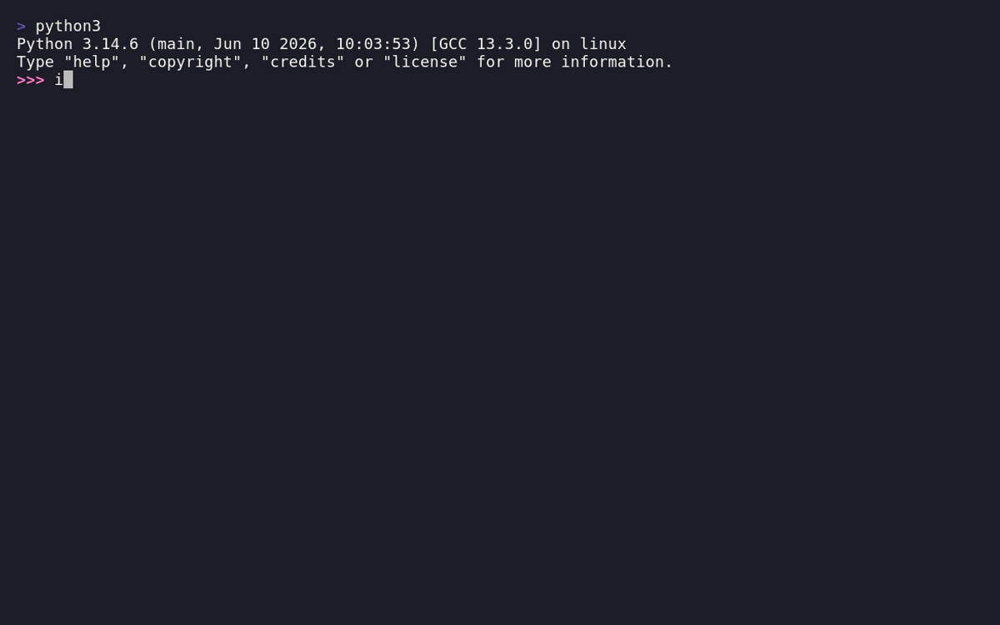

language_tool_python documentation
====================================

`language_tool_python` is a Python wrapper for `LanguageTool <https://github.com/languagetool-org/languagetool>`_,
a free, multilingual, non-AI, open-source grammar, style, and spell checker. This python wrapper lets you detect and fix errors from
a Python script or from the command line, against a local Java server, the public
LanguageTool API, or your own remote server.

- `PyPI <https://pypi.org/project/language-tool-python/>`_
- `GitHub <https://github.com/jxmorris12/language_tool_python>`_
- `Changelog <https://github.com/jxmorris12/language_tool_python/blob/master/CHANGELOG.md>`_

In this documentation
---------------------

.. toctree::
   :maxdepth: 3

   references/modules
